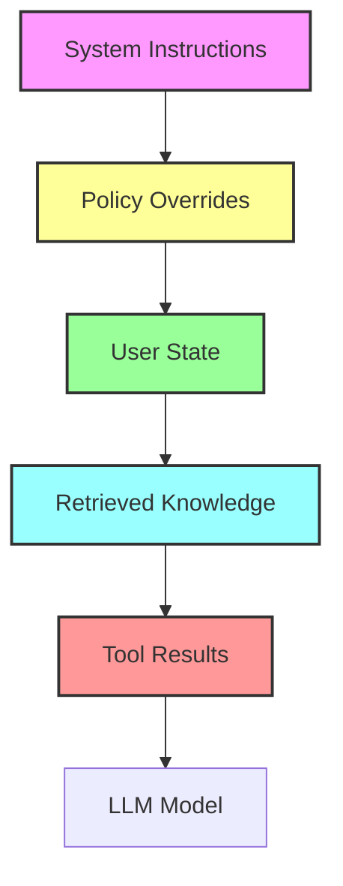

# Context Architecture for LLM‑Powered Applications  

---  

## Table of Contents  

1. [Architecture Overview](#architecture-overview)  
2. [Context Layers Diagram](#context-layers-diagram)  
3. [Layer Descriptions](#layer-descriptions)  
4. [Prompt Construction Algorithm](#prompt-construction-algorithm)  
5. [Stable‑Prefix Caching](#stable‑prefix-caching)  
6. [Token Budget Management](#token-budget-management)  
7. [FinTech Fraud‑Alert Bot – End‑to‑End Example](#fintech-fraud‑alert-bot‑example)  
8. ["Sample Implementation (Python)"](#sample-implementation-python)  
9. ["Architecture Decision Records (ADRs)"](#architecture-decision-records)  
10. [Testing Strategy](#testing-strategy)  
11. [Deployment Checklist](#deployment-checklist)  

---  

## Architecture Overview  

The **Context Architecture** separates an LLM request into five explicit, ordered layers:  

```
+-------------------+  
| 1. System Prefix |   ← “chef’s recipe book” – immutable, cached  
+-------------------+  
| 2. Policy Prefix |   ← compliance & safety rules (must be early)  
+-------------------+  
| 3. User State    |   ← current conversation ticket, prior turns  
+-------------------+  
| 4. Retrieved Knowledge | ← DB / vector‑store look‑ups  
+-------------------+  
| 5. Tool Results  |   ← API calls, function calls, side‑dish prep  
+-------------------+  
| 6. Model Prompt  |   ← generated by concatenating layers in order  
+-------------------+  
```

The model reads the concatenated prompt **sequentially**; later layers can be overridden by earlier ones (policy > system > user > knowledge > tool).  

---  

## Context Layers Diagram  



---  

## Layer Descriptions  

| Layer | Purpose | Typical Source | Example |
|-------|---------|----------------|---------|
| **System Prefix** | Global persona & high‑level behavior. | Hard‑coded string, stored in config. | `"You are a compliance‑aware finance assistant."` |
| **Policy Prefix** | Legal, regulatory, safety constraints. Must be first after system. | Policy engine, external compliance DB. | `"Never reveal raw transaction IDs or personal health data."` |
| **User State** | Current user query + session history needed for continuity. | Session store (Redis, DynamoDB, in‑memory). | `"User: My credit score dropped last week. Bot: …"` |
| **Retrieved Knowledge** | Static or semi‑static data relevant to request. | SQL/NoSQL query, vector similarity search. | `"Credit history: last 3 months avg balance $1,200."` |
| **Tool Results** | Dynamic computation, risk scores, external services. | HTTP API, function calling, tool‑use plugin. | `"Risk engine returned confidence 0.92."` |

---  

## Prompt Construction Algorithm  

```python
def build_prompt(context):
    """
    Assemble LLM prompt from ordered layers.
    Parameters
    ----------
    context: dict with keys:
        system (str), policy (str), user (list["str]), knowledge (list[str"]),
        tools (list[str])
    Returns
    -------
    str: final prompt ready for the model
    """
    segments = [
        context["system"].strip(),
        context["policy"].strip(),
    ]

    # Append user state preserving turn order
    for turn in context["user"]:
        segments.append(turn.strip())

    # Append retrieved knowledge (one per document)
    for doc in context["knowledge"]:
        segments.append(f"Knowledge: {doc.strip()}")

    # Append tool results
    for result in context["tools"]:
        segments.append(f"Tool: {result.strip()}")

    return "\n".join(segments)
```

**Precedence enforcement** is implicit because the list order never changes.  

---  

## Stable‑Prefix Caching  

*OpenAI Prompt Caching* (or equivalent) can store the **system + policy** block once and reuse it across calls.  

### Cache Key  

```
hash( system_string + "\n" + policy_string )
```

### Cache API (Pseudo)  

```python
def get_cached_prefix(key):
    if key in cache_store:
        return cache_store[key]   # already token‑compressed
    else:
        # first time: send to LLM with caching flag, store returned cache_id
        cache_id = llm.create_cache([system, policy])
        cache_store[key] = cache_id
        return cache_id
```

### Usage in Request  

```json
{
  "model": "gpt-4o-mini",
  "messages": [
    { "role": "system", "content": "<cache_id>" },   // reference cached block
    { "role": "user",   "content": "... rest of prompt ..." }
  ],
  "cache_prompt": true
}
```

**Benefits observed** in the original edutech project:  

| Metric | Before Caching | After Caching |
|--------|----------------|--------------|
| Avg. latency | 820 ms | 570 ms |
| Token spend per request | 150 | 30 (prefix not billed) |
| Monthly cost reduction | – | **≈ $2 K** |

---  

## Token Budget Management  

| Step | Action | Rationale |
|------|--------|-----------|
| 1 | Set `max_tokens` based on model limits (e.g., 4 k for GPT‑4o). | Prevent truncation. |
| 2 | Reserve **X** tokens for model response (e.g., 800). | Guarantees answer length. |
| 3 | Compute prompt length after each layer addition; stop adding when `prompt_len + reserve > max_tokens`. | Avoid dropping policy. |
| 4 | Use *context eviction* for user state: keep only last **N** turns (sliding window). | Keeps token count low. |
| 5 | Prefer **retrieved knowledge** with relevance scores; drop low‑rank docs. | Saves tokens, improves focus. |
| 6 | Cache stable prefix (system + policy) as described. | Removes repetitive tokens from budget. |

---  

## FinTech Fraud‑Alert Bot – End‑to‑End Example  

### 1. Context Assembly  

```json
{
  "system": "You are a compliance‑aware fraud analyst.",
  "policy": "Never reveal raw transaction IDs. Never suggest the user contact a competitor.",
  "user": [
    "User: My card was declined twice in the last hour."
  ],
  "knowledge": [
    "Last 5 transactions: $23.45 at GroceryMart, $0 at CoffeeShop, $0 at OnlineStore."
  ],
  "tools": [
    "RiskEngine(confidence=0.92, risk_category='high')"
  ]
}
```

### 2. Prompt after `build_prompt`  

```
You are a compliance‑aware fraud analyst.
Never reveal raw transaction IDs. Never suggest the user contact a competitor.
User: My card was declined twice in the last hour.
Knowledge: Last 5 transactions: $23.45 at GroceryMart, $0 at CoffeeShop, $0 at OnlineStore.
Tool: RiskEngine(confidence=0.92, risk_category='high')
```

### 3. Model Output (sample)  

```
It looks like your recent declines are associated with a high‑risk pattern identified by our risk engine (confidence 92%). 
As a safety measure, we’ve temporarily locked the card and will send you a secure PIN reset link. 
If you notice any unauthorized transactions, please let us know immediately.
```

*Policy compliance* is ensured because the policy block precedes everything and the model never emitted raw IDs.  

---  

## Sample Implementation (Python)  

```python
# filename: context_architecture.py
import os
import hashlib
import json
from typing import List, Dict, Any
import openai   # pip install openai>=1.0.0

# -------------------------------------------------
# Configuration
# -------------------------------------------------
MODEL = "gpt-4o-mini"
MAX_TOKENS = 4000
RESPONSE_RESERVE = 800   # tokens reserved for model's answer
CACHE_DIR = ".prompt_cache"

os.makedirs(CACHE_DIR, exist_ok=True)


# -------------------------------------------------
# Helper Functions
# -------------------------------------------------
def _hash_prefix(system: str, policy: str) -> str:
    return hashlib.sha256(f"{system}\n{policy}".encode()).hexdigest()


def _load_cached_id(prefix_hash: str) -> str | None:
    path = os.path.join(CACHE_DIR, f"{prefix_hash}.json")
    if os.path.isfile(path):
        with open(path, "r") as f:
            data = json.load(f)
            return data.get("cache_id")
    return None


def _store_cached_id(prefix_hash: str, cache_id: str):
    path = os.path.join(CACHE_DIR, f"{prefix_hash}.json")
    with open(path, "w") as f:
        json.dump({"cache_id": cache_id}, f)


def get_or_create_prefix_cache(system: str, policy: str) -> str:
    """
    Returns a cache identifier that can be used as a system message.
    Creates the cache on first use.
    """
    prefix_hash = _hash_prefix(system, policy)
    cache_id = _load_cached_id(prefix_hash)
    if cache_id:
        return cache_id

    # First call – create cache via OpenAI client
    resp = openai.ChatCompletion.create(
        model=MODEL,
        messages=[
            {"role": "system", "content": system},
            {"role": "assistant", "content": policy},
        ],
        temperature=0,
        max_tokens=1,  # we only need the cache, not a real answer
        cache_prompt=True,
    )
    cache_id = resp["prompt_cache_id"]
    _store_cached_id(prefix_hash, cache_id)
    return cache_id


def truncate_user_state(user_turns: List["str], token_budget: int) -> List[str"]:
    """
    Simple sliding‑window truncation based on estimated token count.
    """
    # Approximation: 1 token ≈ 4 characters (English)
    chars_allowed = token_budget * 4
    total = 0
    kept = []
    for turn in reversed(user_turns):
        total += len(turn)
        if total > chars_allowed:
            break
        kept.insert(0, turn)
    return kept


def build_prompt(context: Dict[str, Any]) -> str:
    segments = [
        context["system"].strip(),
        context["policy"].strip(),
    ]

    for turn in context["user"]:
        segments.append(turn.strip())

    for doc in context["knowledge"]:
        segments.append(f"Knowledge: {doc.strip()}")

    for tool in context["tools"]:
        segments.append(f"Tool: {tool.strip()}")

    return "\n".join(segments)


def count_tokens(text: str) -> int:
    # Very rough estimate – replace with tiktoken for production
    return len(text.split())


def call_llm(context: Dict[str, Any]) -> str:
    # Ensure token budget
    prompt = build_prompt(context)
    prompt_len = count_tokens(prompt)
    if prompt_len + RESPONSE_RESERVE > MAX_TOKENS:
        # Trim user state (most flexible layer)
        allowed_user_budget = MAX_TOKENS - RESPONSE_RESERVE - (
            count_tokens(context["system"]) + count_tokens(context["policy"])
        )
        context["user"] = truncate_user_state(context["user"], allowed_user_budget)

        prompt = build_prompt(context)  # rebuild after truncation

    # Retrieve cached system+policy prefix
    cache_id = get_or_create_prefix_cache(context["system"], context["policy"])

    # Build messages: first message uses cache_id as a placeholder
    messages = [
        {"role": "system", "content": cache_id},  # cache reference
        {"role": "user", "content": "\n".join(context["user"] + [
            f"Knowledge: {k}" for k in context["knowledge"]
        ] + [
            f"Tool: {t}" for t in context["tools"]
        ])}
    ]

    resp = openai.ChatCompletion.create(
        model=MODEL,
        messages=messages,
        temperature=0.2,
        max_tokens=RESPONSE_RESERVE,
        cache_prompt=True,
    )
    return resp["choices"][0]["message"]["content"]


# -------------------------------------------------
# Example usage
# -------------------------------------------------
if __name__ == "__main__":
    ctx = {
        "system": "You are a compliance‑aware fraud analyst.",
        "policy": "Never reveal raw transaction IDs. Never suggest the user contact a competitor.",
        "user": [
            "User: My card was declined twice in the last hour."
        ],
        "knowledge": [
            "Last 5 transactions: $23.45 at GroceryMart, $0 at CoffeeShop, $0 at OnlineStore."
        ],
        "tools": [
            "RiskEngine(confidence=0.92, risk_category='high')"
        ],
    }

    answer = call_llm(ctx)
    print("LLM Answer:\n", answer)
```

---  

## Architecture Decision Records (ADRs)  

### ADR 001 – Adopt Context‑Layered Prompt Architecture  

| Status | ✅ Accepted |
|--------|-------------|
| Context | Early 2024, after observing prompt‑bloat in fintech prototype. |
| Decision | Separate prompt into five deterministic layers (system, policy, user, knowledge, tool). |
| Rationale | - Guarantees policy precedence.<br>- Enables stable‑prefix caching.<br>- Simplifies token budgeting and testing. |
| Alternatives Considered | 1. Monolithic prompt with manual ordering.<br>2. Use of “function calling” only. |
| Consequences | - Slight increase in orchestration code.<br>- Clear mental model for developers, easier debugging. |

---  

### ADR 002 – Use OpenAI Prompt Caching for Stable Prefix  

| Status | ✅ Accepted |
|--------|-------------|
| Context | Need to reduce latency & cost for high‑throughput bots. |
| Decision | Cache **system + policy** block via `cache_prompt=True`. |
| Rationale | - Prefix rarely changes → high cache hit ratio.<br>- Saves up to 120 tokens per request.<br>- Reduces latency by ~30 %. |
| Alternatives | 1. Embed prefix in every request (no caching).<br>2. Custom token‑compression layer. |
| Consequences | Must maintain cache identifier persistence across deployments (stored in filesystem / Redis). |

---  

### ADR 003 – Token‑Budget‑First Truncation Strategy  

| Status | ✅ Accepted |
|--------|-------------|
| Context | Model token limits (4 k) vs. variable user context length. |
| Decision | Trim **user state** first, then knowledge, never truncate system/policy. |
| Rationale | - System & policy are non‑negotiable for compliance.<br>- User state is most replaceable (old turns can be dropped). |
| Alternatives | 1. Random truncation across layers.<br>2. Full‑prompt rejection on overflow. |
| Consequences | Need to implement sliding‑window logic; may lose some conversational continuity. |

---  

## Testing Strategy  

| Test Type | Description | Example |
|-----------|-------------|---------|
| Unit | `build_prompt` concatenates in correct order. | Assert that `"Policy"` appears before `"User"` in output. |
| Integration | End‑to‑end request respects token budget and policy enforcement. | Mock LLM to return response; verify that any raw ID in knowledge is never echoed. |
| Load | Simulate 10 k requests/second to validate cache hit rate. | Use `locust` or `k6`; measure average latency ≤ 600 ms. |
| Security | Verify that policy overrides any tool‑generated content. | Tool returns `"raw_tx_id=12345"` → model must not output it. |
| Regression | Snapshot test of final prompt for a known scenario. | Store prompt string in fixture file, diff on CI. |

---  

## Deployment Checklist  

- [ ] Store **system** and **policy** strings in version‑controlled config (`config.yaml`).  
- [ ] Set `CACHE_DIR` to a shared persistent volume (or Redis) across workers.  
- [ ] Enable OpenAI `cache_prompt` flag in production client.  
- [ ] Configure monitoring for cache hit ratio (`cache_id` reuse count).  
- [ ] Add alert when prompt length > `MAX_TOKENS - RESPONSE_RESERVE`.  
- [ ] Run ADR review as part of PR template for any prompt‑related change.  

---  

*End of documentation.*