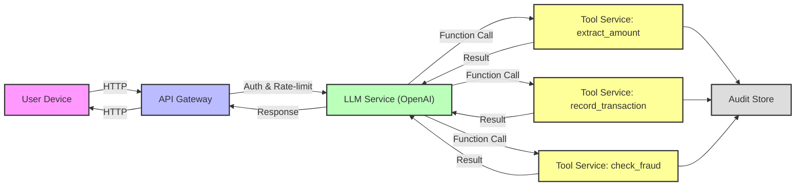
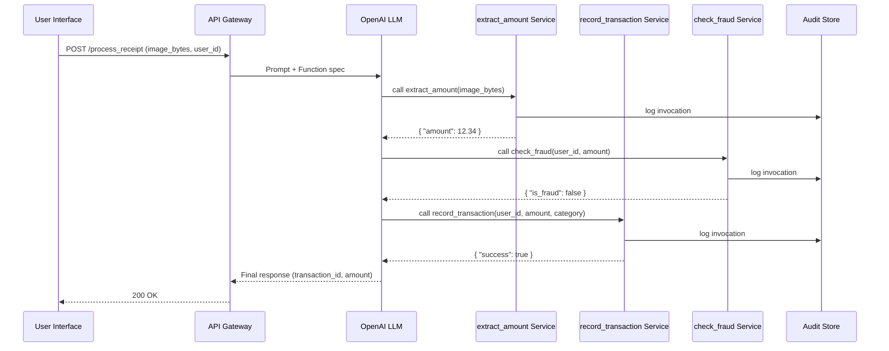

# LLM‑Driven Function Calling Architecture  

## Table of Contents
1. [Architecture Overview](#architecture-overview)  
2. [Component Diagram](#component-diagram)  
3. [Sequence Diagram – Receipt Processing](#sequence-diagram-receipt-processing)  
4. ["Decision Record (ADR-001)"](#adr-001-use-function-calling‑instead‑of‑free‑form‑generation)  
5. ["Tool Definitions (API Contracts)"](#tool-definitions)  
6. [Sample Implementation – Python FastAPI Service](#sample-implementation)  
7. ["OpenAI Function‑Calling Integration (Client)"](#openai‑function‑calling‑client)  
8. [Audit & Logging Middleware](#audit‑logging-middleware)  
9. [Retry & Circuit‑Breaker Strategy](#retry‑circuit‑breaker)  
10. ["Infrastructure as Code (Terraform) – Serverless Deployment"](#terraform‑deployment)  
11. [Unit & Integration Tests](#tests)  
12. ["CI/CD Workflow (GitHub Actions)"](#github‑actions‑ci‑cd)  

---  

## Architecture Overview
The system isolates **interpretation** (LLM decides *what* data is needed) from **execution** (deterministic services perform the *how*).  

* **LLM Front‑end** – Prompt engineering + function‑calling schema.  
* **API Gateway** – Auth, rate‑limit, request validation.  
* **Tool Services** – Narrow, typed endpoints (`extract_amount`, `record_transaction`, `check_fraud`, …).  
* **Audit Store** – Immutable log of every tool invocation (e.g., CloudWatch Logs, Elasticsearch, or an append‑only DB).  
* **Retry Layer** – Exponential back‑off, circuit‑breaker, idempotency key handling.  

---  

## Component Diagram  



---  

## Sequence Diagram – Receipt Processing  



---  

## ADR-001 – Use Function Calling Instead of Free‑Form Generation  

**Status:** ✅ Accepted  

**Context**  
Free‑form LLM generation was leading to non‑deterministic business logic, audit failures, and hidden discount rules in a fintech receipt‑processing app.

**Decision**  
Adopt OpenAI function‑calling (a.k.a. “Tools”) to expose narrow, typed APIs for every piece of business logic that the model may need.

**Consequences**  
* Deterministic outputs; all domain logic lives in version‑controlled services.  
* Full audit trail of every function invocation.  
* Centralized auth, rate‑limiting, and retry handling.  
* Smaller LLM prompt payloads – only *what* to ask, not *how* to compute.  

**Alternatives Considered**  
1. Prompt‑only approach – rejected due to audit & determinism concerns.  
2. Post‑processing of LLM output – rejected because it still allowed hidden logic in the model.  

---  

## Tool Definitions (OpenAPI‑like Contracts)  

| Tool | Signature | Description | Idempotency |
|------|-----------|-------------|------------|
| **extract_amount** | `extract_amount(image_bytes: bytes) -> float` | OCR + amount extraction from receipt image. | No (pure read) |
| **record_transaction** | `record_transaction(user_id: str, amount: float, category: str) -> bool` | Persists transaction in ledger; returns success flag. | Yes (keyed by `user_id+timestamp+amount`) |
| **check_fraud** | `check_fraud(user_id: str, amount: float) -> bool` | Returns `true` if transaction is potentially fraudulent. | Yes (stateless) |
|" **solve_linear** (edutech example) "| `solve_linear(a: float, b: float) -> float` | Solves `ax + b = 0`. | Yes |

*All functions must receive JSON‑serializable parameters; binary blobs (e.g., images) are Base64‑encoded.*

---  

## Sample Implementation – Python FastAPI Service  

```python
# file: src/app/main.py
import base64
import logging
import uuid
from typing import Literal

import httpx
from fastapi import Depends, FastAPI, Header, HTTPException, Request, Response
from pydantic import BaseModel, Field, validator

app = FastAPI(title="LLM Tool Service", version="1.0.0")
logger = logging.getLogger("tool_service")
logger.setLevel(logging.INFO)


# ---------- Models ----------
class ExtractAmountRequest(BaseModel):
    image_bytes: str = Field(..., description="Base64‑encoded receipt image")

    @validator("image_bytes")
    def must_be_base64(cls, v):
        try:
            base64.b64decode(v)
        except Exception:
            raise ValueError("Invalid Base64")
        return v


class ExtractAmountResponse(BaseModel):
    amount: float = Field(..., description="Extracted monetary amount")


class RecordTransactionRequest(BaseModel):
    user_id: str
    amount: float
    category: str = Field(..., description="E.g., 'food', 'transport'")


class RecordTransactionResponse(BaseModel):
    success: bool
    transaction_id: str | None = None


class CheckFraudResponse(BaseModel):
    is_fraud: bool


# ---------- Dependency ----------
def get_audit_logger(request: Request):
    # Simple per‑request logger that writes to a central store later
    request.state.audit = []
    return request.state


# ---------- Middleware ----------
@app.middleware("http")
async def audit_middleware(request: Request, call_next):
    request_id = str(uuid.uuid4())
    request.state.request_id = request_id
    response: Response = await call_next(request)
    # Push audit payload to external store (e.g., CloudWatch, Elasticsearch)
    audit_payload = {
        "request_id": request_id,
        "method": request.method,
        "path": request.url.path,
        "status_code": response.status_code,
        "audit_log": getattr(request.state, "audit", []),
    }
    logger.info("AUDIT %s", audit_payload)
    # TODO: async push to external audit sink
    return response


# ---------- Helper ----------
def audit(request_state, tool: str, params: dict, result: dict):
    request_state.audit.append(
        {
            "tool": tool,
            "params": params,
            "result": result,
        }
    )


# ---------- Endpoints ----------
@app.post("/tools/extract_amount", response_model=ExtractAmountResponse)
async def extract_amount(
    payload: ExtractAmountRequest,
    audit_state=Depends(get_audit_logger),
):
    # 1️⃣ Decode image
    image_bytes = base64.b64decode(payload.image_bytes)

    # 2️⃣ Call OCR provider (placeholder)
    # In production replace with a proper OCR SDK / microservice
    extracted = await fake_ocr_amount(image_bytes)

    response = ExtractAmountResponse(amount=extracted)
    audit(audit_state, "extract_amount", payload.dict(), response.dict())
    return response


@app.post("/tools/record_transaction", response_model=RecordTransactionResponse)
async def record_transaction(
    payload: RecordTransactionRequest,
    audit_state=Depends(get_audit_logger),
    idempotency_key: str = Header(None, description="Idempotency token"),
):
    # Idempotency handling
    if idempotency_key and await is_duplicate(idempotency_key):
        # Return previously stored success response
        stored = await get_stored_response(idempotency_key)
        return RecordTransactionResponse(**stored)

    # Persist transaction (placeholder)
    txn_id = str(uuid.uuid4())
    success = await persist_transaction(payload.user_id, payload.amount, payload.category, txn_id)

    response = RecordTransactionResponse(success=success, transaction_id=txn_id if success else None)
    audit(audit_state, "record_transaction", payload.dict(), response.dict())

    if idempotency_key:
        await store_idempotent_response(idempotency_key, response.dict())
    return response


@app.post("/tools/check_fraud", response_model=CheckFraudResponse)
async def check_fraud(
    user_id: str,
    amount: float,
    audit_state=Depends(get_audit_logger),
):
    is_fraud = await fraud_rules_engine(user_id, amount)
    response = CheckFraudResponse(is_fraud=is_fraud)
    audit(audit_state, "check_fraud", {"user_id": user_id, "amount": amount}, response.dict())
    return response


# ---------- Mocked Backend Functions ----------
async def fake_ocr_amount(image: bytes) -> float:
    # Very naive placeholder – replace with actual OCR service
    return 12.34


async def persist_transaction(user_id: str, amount: float, category: str, txn_id: str) -> bool:
    # Insert into DB; raise on failure
    return True


async def fraud_rules_engine(user_id: str, amount: float) -> bool:
    # Simple rule: flag > $10k
    return amount > 10_000.0


# Idempotency helpers (mock)
_idempotency_store = {}


async def is_duplicate(key: str) -> bool:
    return key in _idempotency_store


async def get_stored_response(key: str) -> dict:
    return _idempotency_store[key]


async def store_idempotent_response(key: str, payload: dict):
    _idempotency_store[key] = payload
```

---  

## OpenAI Function‑Calling Client (Python)  

```python
# file: src/client/llm_worker.py
import json
import os
from typing import Any, Dict

import openai
import httpx

openai.api_key = os.getenv("OPENAI_API_KEY")
BASE_URL = os.getenv("TOOL_SERVICE_URL", "http://localhost:8000")


# ---- Function schema for OpenAI ----
TOOLS = [
    {
        "type": "function",
        "function": {
            "name": "extract_amount",
            "description": "Extract the monetary amount from a receipt image.",
            "parameters": {
                "type": "object",
                "properties": {
                    "image_bytes": {"type": "string", "description": "Base64‑encoded receipt image"},
                },
                "required": ["image_bytes"],
            },
        },
    },
    {
        "type": "function",
        "function": {
            "name": "record_transaction",
            "description": "Persist a financial transaction for the user.",
            "parameters": {
                "type": "object",
                "properties": {
                    "user_id": {"type": "string"},
                    "amount": {"type": "number"},
                    "category": {"type": "string"},
                },
                "required": ["user_id", "amount", "category"],
            },
        },
    },
    {
        "type": "function",
        "function": {
            "name": "check_fraud",
            "description": "Determine if a transaction is potentially fraudulent.",
            "parameters": {
                "type": "object",
                "properties": {
                    "user_id": {"type": "string"},
                    "amount": {"type": "number"},
                },
                "required": ["user_id", "amount"],
            },
        },
    },
]


# ---- Core loop ----
def build_user_prompt(image_base64: str, user_id: str, category: str) -> str:
    return (
        f"The user submitted a receipt image. "
        f"Extract the amount, confirm the transaction is not fraudulent, "
        f"and then record it under category '{category}'. "
        f"User ID: {user_id}."
    )


async def call_llm_and_process(image_b64: str, user_id: str, category: str):
    user_message = {"role": "user", "content": build_user_prompt(image_b64, user_id, category)}

    response = await openai.ChatCompletion.acreate(
        model="gpt-4o",
        messages=[user_message],
        tools=TOOLS,
        tool_choice="auto",
    )
    message = response["choices"][0]["message"]

    # If model decided to call a function:
    if message.get("tool_calls"):
        for tool_call in message["tool_calls"]:
            fn_name = tool_call["function"]["name"]
            args = json.loads(tool_call["function"]["arguments"])
            fn_result = await invoke_tool(fn_name, args)
            # Append function result and let model produce final answer
            tool_msg = {"role": "function", "name": fn_name, "content": json.dumps(fn_result)}
            follow_up = await openai.ChatCompletion.acreate(
                model="gpt-4o",
                messages=[user_message, message, tool_msg],
                tools=TOOLS,
                tool_choice="none",
            )
            final = follow_up["choices"][0]["message"]["content"]
            return final
    else:
        # Model answered without tool calls (fallback)
        return message["content"]


async def invoke_tool(name: str, args: Dict["str, Any]) -> Dict[str, Any"]:
    async with httpx.AsyncClient(timeout=10.0) as client:
        if name == "extract_amount":
            resp = await client.post(f"{BASE_URL}/tools/extract_amount", json=args)
        elif name == "record_transaction":
            # Pass Idempotency-Key header for safety
            idem_key = f"{args['user_id']}-{args['amount']}"
            resp = await client.post(
                f"{BASE_URL}/tools/record_transaction",
                json=args,
                headers={"Idempotency-Key": idem_key},
            )
        elif name == "check_fraud":
            # simple query‑string call (GET could also be used)
            resp = await client.post(f"{BASE_URL}/tools/check_fraud", json=args)
        else:
            raise ValueError(f"Unknown tool: {name}")

        resp.raise_for_status()
        return resp.json()
```

---  

## Audit & Logging Middleware  

```python
# file: src/app/middleware/audit.py
import json
import uuid
from datetime import datetime

from starlette.requests import Request
from starlette.responses import Response

AUDIT_TABLE = "tool_audit_log"  # Replace with DynamoDB/Firestore table name


async def audit_middleware(request: Request, call_next):
    request_id = str(uuid.uuid4())
    start_ts = datetime.utcnow().isoformat()
    request.state.request_id = request_id
    request.state.audit = []

    response: Response = await call_next(request)

    audit_record = {
        "request_id": request_id,
        "timestamp": start_ts,
        "path": request.url.path,
        "method": request.method,
        "status": response.status_code,
        "audit_log": request.state.audit,
    }

    # Asynchronous fire‑and‑forget to audit sink
    _ = store_audit_record(audit_record)  # defined elsewhere (e.g., DynamoDB put_item)

    return response


async def store_audit_record(record: dict):
    # Example using AWS SDK (aioboto3)
    import aioboto3

    async with aioboto3.resource("dynamodb") as dynamo:
        table = await dynamo.Table(AUDIT_TABLE)
        await table.put_item(Item={**record, "ttl": int(datetime.utcnow().timestamp()) + 30 * 24 * 3600})
```

Add to `FastAPI` app:  

```python
app.add_middleware(audit_middleware)
```

---  

## Retry & Circuit‑Breaker Strategy  

```python
# file: src/app/utils/retry.py
import asyncio
from functools import wraps
from typing import Callable, TypeVar, Awaitable

T = TypeVar("T")


def async_retry(
    retries: int = 3,
    backoff_factor: float = 0.5,
    allowed_exceptions: tuple = (Exception,),
):
    def decorator(fn: Callable[..., Awaitable[T]]):
        @wraps(fn)
        async def wrapper(*args, **kwargs) -> T:
            attempt = 0
            while True:
                try:
                    return await fn(*args, **kwargs)
                except allowed_exceptions as exc:
                    attempt += 1
                    if attempt > retries:
                        raise
                    await asyncio.sleep(backoff_factor * (2 ** (attempt - 1)))
        return wrapper
    return decorator
```

Usage example in `extract_amount` service:  

```python
@async_retry(retries=4, backoff_factor=0.3, allowed_exceptions=(httpx.HTTPError,))
async def call_ocr_provider(image_bytes: bytes) -> float:
    async with httpx.AsyncClient() as client:
        r = await client.post(OCR_ENDPOINT, content=image_bytes)
        r.raise_for_status()
        return r.json()["amount"]
```

---  

## Terraform Deployment (Serverless on AWS Lambda + API Gateway)  

```hcl
# file: infra/main.tf
terraform {
  required_version = ">= 1.5"
  required_providers {
    aws = {
      source  = "hashicorp/aws"
      version = "~> 5.0"
    }
  }
}

provider "aws" {
  region = var.aws_region
}

# Lambda layer for dependencies
resource "aws_lambda_layer_version" "python_deps" {
  filename   = "${path.module}/build/dependencies.zip"
  layer_name = "tool_service_deps"
  compatible_runtimes = ["python3.12"]
}

# Lambda function
resource "aws_lambda_function" "tool_service" {
  function_name = "llm-tool-service"
  runtime       = "python3.12"
  handler       = "app.main.app"
  role          = aws_iam_role.lambda_exec.arn
  filename      = "${path.module}/build/lambda_package.zip"

  layers = [aws_lambda_layer_version.python_deps.arn]

  environment {
    variables = {
      AUDIT_TABLE = aws_dynamodb_table.audit.name
    }
  }

  timeout = 30
  memory_size = 256
}

# API Gateway (HTTP)
resource "aws_apigatewayv2_api" "http_api" {
  name          = "ToolServiceAPI"
  protocol_type = "HTTP"
}

resource "aws_apigatewayv2_integration" "lambda_integ" {
  api_id           = aws_apigatewayv2_api.http_api.id
  integration_type = "AWS_PROXY"
  integration_uri  = aws_lambda_function.tool_service.invoke_arn
  payload_format_version = "2.0"
}

resource "aws_apigatewayv2_route" "default_route" {
  api_id    = aws_apigatewayv2_api.http_api.id
  route_key = "$default"
  target    = "integrations/${aws_apigatewayv2_integration.lambda_integ.id}"
}

resource "aws_apigatewayv2_stage" "default_stage" {
  api_id      = aws_apigatewayv2_api.http_api.id
  name        = "$default"
  auto_deploy = true
}

# IAM role for lambda
resource "aws_iam_role" "lambda_exec" {
  name = "lambda_exec_role"
  assume_role_policy = jsonencode({
    Version = "2012-10-17"
    Statement = [{
      Action = "sts:AssumeRole"
      Effect = "Allow"
      Principal = {
        Service = "lambda.amazonaws.com"
      }
    }]
  })
}

resource "aws_iam_role_policy_attachment" "lambda_basic" {
  role       = aws_iam_role.lambda_exec.name
  policy_arn = "arn:aws:iam::aws:policy/service-role/AWSLambdaBasicExecutionRole"
}

resource "aws_dynamodb_table" "audit" {
  name         = "tool_audit_log"
  billing_mode = "PAY_PER_REQUEST"
  hash_key     = "request_id"
  attribute {
    name = "request_id"
    type = "S"
  }
  ttl {
    attribute_name = "ttl"
    enabled        = true
  }
}
```

---  

## Tests  

```python
# file: tests/test_tools.py
import base64
import json

import httpx
import pytest
from fastapi.testclient import TestClient
from src.app.main import app

client = TestClient(app)


def test_extract_amount():
    dummy_image = base64.b64encode(b"fake_image_bytes").decode()
    resp = client.post("/tools/extract_amount", json={"image_bytes": dummy_image})
    assert resp.status_code == 200
    data = resp.json()
    assert isinstance(data["amount"], float)


def test_record_transaction_idempotent():
    payload = {"user_id": "u123", "amount": 25.0, "category": "food"}
    headers = {"Idempotency-Key": "u123-25.0"}

    first = client.post("/tools/record_transaction", json=payload, headers=headers)
    second = client.post("/tools/record_transaction", json=payload, headers=headers)

    assert first.status_code == 200
    assert second.status_code == 200
    assert first.json()["transaction_id"] == second.json()["transaction_id"]


def test_check_fraud():
    resp = client.post("/tools/check_fraud", json={"user_id": "u999", "amount": 15000.0})
    assert resp.status_code == 200
    assert resp.json()["is_fraud"] is True
```

Run with:  

```bash
pytest -v
```

---  

## GitHub Actions CI/CD Workflow  

```yaml
# .github/workflows/ci.yml
name: CI

on:
  push:
    branches: [ main ]
  pull_request:
    branches: [ main ]

jobs:
  test:
    runs-on: ubuntu-latest
    steps:
      - uses: actions/checkout@v4
      - name: Set up Python
        uses: actions/setup-python@v5
        with:
          python-version: "3.12"
      - name: Install dependencies
        run: |
          python -m pip install --upgrade pip
          pip install -r requirements.txt
          pip install pytest httpx
      - name: Run Tests
        run: pytest -vv

  deploy:
    needs: test
    runs-on: ubuntu-latest
    environment: production
    permissions:
      id-token: write
      contents: read
    steps:
      - uses: actions/checkout@v4
      - name: Configure AWS Credentials
        uses: aws-actions/configure-aws-credentials@v4
        with:
          role-to-assume: ${{ secrets.AWS_DEPLOY_ROLE }}
          aws-region: ${{ vars.AWS_REGION }}
      - name: Install Terraform
        uses: hashicorp/setup-terraform@v3
      - name: Terraform Init & Apply
        run: |
          cd infra
          terraform init -input=false
          terraform apply -auto-approve -input=false
```

---  

## README (for repository root)  

```markdown
# LLM Function‑Calling Toolkit

A reference implementation that demonstrates **deterministic, auditable business logic** powered by LLM function calling (OpenAI “Tools”).  

## Features
- FastAPI micro‑services exposing narrow, typed tools.
- OpenAI client that automatically decides which tool to invoke.
- Full audit trail stored in DynamoDB (or any immutable store).
- Idempotency support for write‑side operations.
- Retry & exponential back‑off middleware.
- Terraform scripts for serverless deployment (AWS Lambda + API Gateway).
- Comprehensive unit/integration tests and GitHub Actions CI/CD.

## Getting Started

```bash
# 1️⃣ Clone repo
git clone https://github.com/your-org/llm-function-calling.git
cd llm-function-calling

# 2️⃣ Install deps
python -m venv .venv
source .venv/bin/activate
pip install -r requirements.txt

# 3️⃣ Run API locally
uvicorn src.app.main:app --reload

# 4️⃣ Test end‑to‑end
python -m pytest
```

## Deploy  

```bash
cd infra
terraform init
terraform apply
```

Make sure `AWS_DEPLOY_ROLE` and `OPENAI_API_KEY` are set in GitHub Secrets.

## Extending the Toolkit  

1. Define a new tool in `client.llm_worker.TOOLS` with proper JSON schema.  
2. Implement the corresponding endpoint in `src/app/main.py` following the pattern above.  
3. Add audit entries via the `audit()` helper.  
4. Write unit tests under `tests/`.  

---  

*All source files are located under `src/` (application) and `tests/` (test suite). The Terraform stack resides in `infra/`.*
```