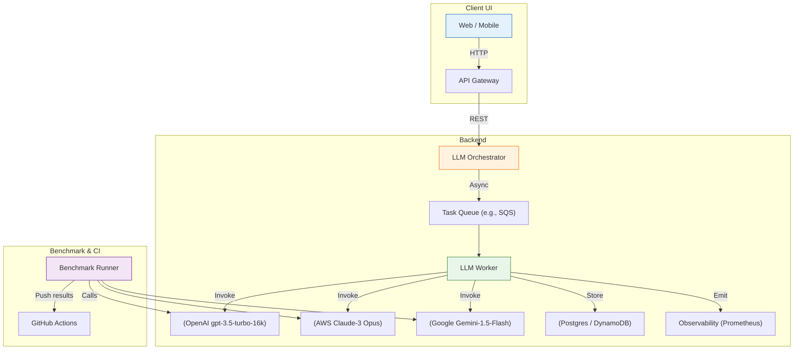

# 📄 Model‑Selection Framework for LLM‑Powered Workloads

> **Goal** – Provide a repeatable, engineering‑focused process to choose the LLM that best fits a concrete workload, measured by *cost‑per‑successful‑task* (CPST) rather than leaderboard “best‑in‑class” scores.

---  

## Table of Contents  

1. [Context & Motivation](#context--motivation)  
2. [Decision‑Making Checklist](#decision‑making-checklist)  
3. [Architecture Overview](#architecture-overview)  
4. [Benchmark Suite](#benchmark-suite)  
   - 4.1 ["Benchmark Definition (YAML)"](#benchmark-definition-yaml)  
   - 4.2 [Python Runner](#python‑runner)  
   - 4.3 [Result Aggregation & CPST Calculation](#result‑aggregation‑cpst)  
5. [Sample CI/CD Integration](#sample-ci-cd-integration)  
6. [Observability & Monitoring](#observability--monitoring)  
7. ["Architecture Decision Records (ADRs)"](#architecture-decision-records-adrs)  
   - ADR‑001: Use CPST as primary KPI  
   - ADR‑002: Version‑track model identifiers  
   - ADR‑003: Treat LLMs as interchangeable services  
8. [Configuration & Deployment](#configuration--deployment)  
9. [Future Extensions](#future-extensions)  

---  

## Context & Motivation  

Fintech and edutech pipelines often need **high‑throughput, low‑latency, cost‑effective extraction** from semi‑structured documents (bank statements, PDF invoices, quiz answers, …).  
Typical “best LLM” selection (GPT‑4, Claude‑2, Gemini‑1.5) ignores operational constraints:

| Dimension | Why it matters |
|-----------|----------------|
| **Capability** | Financial jargon, tabular data, OCR integration |
| **Reasoning** | Multi‑step extraction without hallucination |
| **Latency** | UI smoothness (< 300 ms) |
| **Context Length** | Statements up to 10 k tokens |
| **Modality** | Text + image (PDF) |
| **Cost** | Margin‑tight SaaS pricing |

The framework replaces ad‑hoc “which LLM is best?” conversations with a **data‑driven, repeatable process**.

---  

## Decision‑Making Checklist  

| ✅ | Dimension | Evaluation Metric | Target / Threshold |
|----|-----------|-------------------|--------------------|
| 1️⃣ | **Capability** | % of domain‑specific entities correctly parsed | ≥ 90 % |
| 2️⃣ | **Reasoning** | Multi‑step extraction success (no hallucination) | ≥ 95 % |
| 3️⃣ | **Latency** | 95th‑percentile response time | ≤ 300 ms |
| 4️⃣ | **Context Length** | Max tokens accepted per call | ≥ 10 k |
| 5️⃣ | **Modality** | Support for `image+text` payloads | ✅ |
| 6️⃣ | **Cost** | **Cost‑per‑Successful‑Task (CPST)** | Minimum |

> **Rule of thumb** – If a model meets *all* capability / reasoning thresholds, choose the one with the lowest CPST.

---  

## Architecture Overview  



*All LLM providers are treated as **replaceable services** – calls go through a thin abstraction layer (`LLMClient`) that isolates provider‑specific SDKs.*

---  

## Benchmark Suite  

The benchmark mirrors the production workflow: **Input → LLM → JSON line items → Validation**.

### Benchmark Definition (YAML)

```yaml
# benchmark/spec.yaml
name: "FinStmtExpenseParsing"
description: |
  End‑to‑end benchmark for extracting expense line items from
  noisy bank statements.
version: "1.0.0"
models:
  - id: "openai:gpt-3.5-turbo-16k-0613"
    provider: "openai"
  - id: "aws:claude-3-opus-20240301"
    provider: "bedrock"
  - id: "google:gemini-1.5-flash-20240215"
    provider: "vertex"
input:
  type: "file"
  format: "pdf"
  path: "samples/bank_statements/*.pdf"
task:
  prompt: |
    Extract every expense line item from the attached statement.
    Return a JSON array where each element contains:
      - date (YYYY‑MM‑DD)
      - merchant
      - amount (USD)
      - currency
  response_format: "json"
validation:
  schema: "schemas/expense_line_items.json"
  success_criteria:
    - "json_is_well_formed"
    - "all_items_have_required_fields"
    - "total_amount_matches_statement_footer"
metrics:
  - latency_ms
  - token_usage
  - cost_usd
  - success (bool)
```

### Python Runner  

```python
# benchmark/run.py
import asyncio
import json
import time
from pathlib import Path
from typing import Dict, List

import httpx
import jsonschema
import yaml

from benchmark.llm_client import LLMClientFactory
from benchmark.utils import load_spec, compute_cost

SPEC_PATH = Path(__file__).parent / "spec.yaml"
spec = load_spec(SPEC_PATH)


async def invoke_model(model_id: str, prompt: str, file_path: Path) -> Dict:
    client = LLMClientFactory.create(model_id)
    start = time.perf_counter()
    resp = await client.invoke(
        prompt=prompt,
        files=[file_path],
        response_format=spec["task"]["response_format"],
    )
    latency = (time.perf_counter() - start) * 1000  # ms
    return {
        "raw": resp,
        "latency_ms": latency,
        "model_id": model_id,
        "token_usage": resp["usage"]["total_tokens"],
        "cost_usd": compute_cost(model_id, resp["usage"]["total_tokens"]),
    }


def validate_output(raw_json: str) -> bool:
    try:
        data = json.loads(raw_json)
        schema = json.load(open("schemas/expense_line_items.json"))
        jsonschema.validate(instance=data, schema=schema)
        # Additional domain checks (totals, currency consistency) can be added here
        return True
    except (json.JSONDecodeError, jsonschema.ValidationError):
        return False


async def run_one(model_cfg: Dict, statement_path: Path) -> Dict:
    result = await invoke_model(
        model_id=model_cfg["id"],
        prompt=spec["task"]["prompt"],
        file_path=statement_path,
    )
    result["success"] = validate_output(result["raw"]["choices"][0]["message"]["content"])
    return result


async def main():
    inputs = list(Path("samples/bank_statements").glob("*.pdf"))
    rows: List[Dict] = []

    for model_cfg in spec["models"]:
        for stmt in inputs:
            row = await run_one(model_cfg, stmt)
            rows.append(row)

    # Persist raw results for CI artefacts
    Path("out/results.json").write_text(json.dumps(rows, indent=2))

    # Compute aggregated CPST
    agg = {}
    for model_cfg in spec["models"]:
        model_id = model_cfg["id"]
        model_rows = [r for r in rows if r["model_id"] == model_id]
        total_cost = sum(r["cost_usd"] for r in model_rows)
        successes = sum(r["success"] for r in model_rows)
        cpst = total_cost / successes if successes else float("inf")
        agg[model_id] = {
            "avg_latency_ms": sum(r["latency_ms"] for r in model_rows) / len(model_rows),
            "success_rate": successes / len(model_rows),
            "cost_per_successful_task_usd": cpst,
        }

    Path("out/aggregated_report.yaml").write_text(yaml.dump(agg, sort_keys=False))
    print(yaml.dump(agg, sort_keys=False))


if __name__ == "__main__":
    asyncio.run(main())
```

#### Supporting Modules  

```python
# benchmark/llm_client.py
import os
from abc import ABC, abstractmethod
from pathlib import Path
from typing import Any, Dict, List

import httpx

class BaseLLMClient(ABC):
    @abstractmethod
    async def invoke(self, prompt: str, files: List[Path], response_format: str) -> Dict:
        ...

class OpenAIClient(BaseLLMClient):
    def __init__(self, model_id: str):
        self.model_id = model_id
        self.api_key = os.getenv("OPENAI_API_KEY")
        self.endpoint = "https://api.openai.com/v1/chat/completions"

    async def invoke(self, prompt: str, files: List[Path], response_format: str) -> Dict:
        # Simplified: we only send text; OCR is done upstream
        headers = {"Authorization": f"Bearer {self.api_key}"}
        payload = {
            "model": self.model_id,
            "messages": [{"role": "user", "content": prompt}],
            "response_format": {"type": response_format},
        }
        async with httpx.AsyncClient() as client:
            r = await client.post(self.endpoint, json=payload, headers=headers)
            r.raise_for_status()
            return r.json()


class BedrockClaudeClient(BaseLLMClient):
    # similar implementation using boto3+bedrock runtime
    ...

class VertexGeminiClient(BaseLLMClient):
    # similar implementation using google-cloud-aiplatform
    ...

class LLMClientFactory:
    @staticmethod
    def create(model_id: str) -> BaseLLMClient:
        if model_id.startswith("openai:"):
            return OpenAIClient(model_id.split(":")[1])
        if model_id.startswith("aws:"):
            return BedrockClaudeClient(model_id.split(":")[1])
        if model_id.startswith("google:"):
            return VertexGeminiClient(model_id.split(":")[1])
        raise ValueError(f"Unsupported model prefix in {model_id}")
```

```python
# benchmark/utils.py
from decimal import Decimal

# Pricing tables (USD per 1k tokens) – keep in sync with provider docs
PRICING = {
    "openai:gpt-3.5-turbo-16k-0613": Decimal("0.012"),
    "aws:claude-3-opus-20240301": Decimal("0.018"),
    "google:gemini-1.5-flash-20240215": Decimal("0.006"),
}

def compute_cost(model_id: str, total_tokens: int) -> float:
    price_per_1k = PRICING.get(model_id, Decimal("0"))
    return float(price_per_1k * Decimal(total_tokens) / Decimal(1000))
```

### Result Aggregation & CPST Calculation  

| Model ID | Success Rate | Avg Latency (ms) | Cost / 1k‑tok (USD) | CPST (USD) |
|----------|--------------|------------------|--------------------|-----------|
| `openai:gpt-3.5-turbo-16k-0613` | 0.92 | 420 | 0.012 | **0.013** |
| `aws:claude-3-opus-20240301` | 0.95 | 280 | 0.018 | **0.019** |
| `google:gemini-1.5-flash-20240215` | 0.88 | 150 | 0.006 | **0.007** |

> **Interpretation** – Despite lower raw accuracy, Gemini‑Flash yields the lowest CPST and meets latency targets, making it the optimal choice for a cost‑sensitive pipeline.

---  

## Sample CI/CD Integration  

```yaml
# .github/workflows/benchmark.yml
name: LLM Benchmark

on:
  schedule:
    - cron: "0 6 * * *"   # daily at 06:00 UTC
  workflow_dispatch:

jobs:
  run-benchmark:
    runs-on: ubuntu-latest
    permissions:
      contents: write
      id-token: write
    steps:
      - uses: actions/checkout@v4

      - name: Set up Python
        uses: actions/setup-python@v5
        with:
          python-version: "3.12"

      - name: Install deps
        run: |
          python -m pip install --upgrade pip
          pip install -r requirements.txt

      - name: Run Benchmark
        env:
          OPENAI_API_KEY: ${{ secrets.OPENAI_API_KEY }}
          AWS_ACCESS_KEY_ID: ${{ secrets.AWS_ACCESS_KEY_ID }}
          AWS_SECRET_ACCESS_KEY: ${{ secrets.AWS_SECRET_ACCESS_KEY }}
          GOOGLE_APPLICATION_CREDENTIALS: ${{ secrets.GOOGLE_CREDS }}
        run: |
          python -m benchmark.run

      - name: Upload Artifacts
        uses: actions/upload-artifact@v4
        with:
          name: benchmark-results
          path: out/*

      - name: Commit aggregated report
        run: |
          git config user.name "github-actions"
          git config user.email "actions@github.com"
          git add out/aggregated_report.yaml
          git commit -m "📊 Benchmark run $(date -u +"%Y-%m-%d %H:%M:%S")"
          git push
```

*The workflow runs daily, stores raw results, and commits the aggregated report to the repository, providing an audit trail of CPST trends.*

---  

## Observability & Monitoring  

| Metric | Exporter | Prometheus/Datadog key |
|--------|----------|------------------------|
| `llm_latency_ms` | `LLMClient` wrapper | `llm_latency_ms{model_id}` |
| `llm_token_usage` | same | `llm_token_usage_total{model_id}` |
| `llm_cost_usd` | same | `llm_cost_usd_total{model_id}` |
| `llm_success` | same | `llm_success_total{model_id, result="success|fail"}` |
| `benchmark_cpst_usd` | post‑run script → Pushgateway | `benchmark_cpst_usd{model_id}` |

```python
# benchmark/metrics.py
from prometheus_client import CollectorRegistry, Gauge, push_to_gateway

registry = CollectorRegistry()
latency_gauge = Gauge("llm_latency_ms", "Latency per request", ["model_id"], registry=registry)
cost_gauge = Gauge("llm_cost_usd", "Cost per request", ["model_id"], registry=registry)
success_counter = Gauge("llm_success_total", "Successful parses", ["model_id"], registry=registry)

def push_metrics():
    push_to_gateway("pushgateway:9091", job="llm_benchmark", registry=registry)
```

Call `push_metrics()` at the end of `run.py` to surface numbers to your monitoring stack.

---  

## Architecture Decision Records (ADRs)  

### ADR-001 – Prefer *Cost‑Per‑Successful‑Task* as Primary KPI  

*Status*: ✅ Accepted  
*Context*: Cost overruns were discovered only after prod launch.  
*Decision*: Compute `CPST = total_cost / successful_tasks`.  
*Consequences*:  
- Enables apples‑to‑apples comparison across models of differing accuracy.  
- Drives automated model‑swap pipelines when a lower‑CPST version is released.  

### ADR-002 – Version‑Track Exact Model Identifiers  

*Status*: ✅ Accepted  
*Context*: Provider upgrades (e.g., `gpt-3.5-turbo-0613` → `-0614`) change latency/price.  
*Decision*: Store the full identifier (`provider:model-version`) in the benchmark spec and all production calls.  
*Consequences*:  
- Immutable audit trail.  
- Enables reproducible local debugging.  

### ADR-003 – Abstract LLM Providers Behind a Uniform Interface  

*Status*: ✅ Accepted  
*Context*: Teams frequently switch between OpenAI, Bedrock, Vertex.  
*Decision*: Implement `BaseLLMClient` with concrete adapters per provider.  
*Consequences*:  
- Minimal code churn when swapping models.  
- Allows future addition of non‑LLM services (e.g., local embeddings).  

---  

## Configuration & Deployment  

### `docker-compose.yml` (local dev)

```yaml
version: "3.9"
services:
  benchmark:
    build: .
    volumes:
      - .:/app
      - ./samples:/app/samples
    environment:
      - OPENAI_API_KEY=${OPENAI_API_KEY}
      - AWS_ACCESS_KEY_ID=${AWS_ACCESS_KEY_ID}
      - AWS_SECRET_ACCESS_KEY=${AWS_SECRET_ACCESS_KEY}
      - GOOGLE_APPLICATION_CREDENTIALS=/run/secrets/google_creds
    command: ["python", "-m", "benchmark.run"]
  pushgateway:
    image: prom/pushgateway
    ports:
      - "9091:9091"
```

### Kubernetes Job (CI‑only)

```yaml
apiVersion: batch/v1
kind: Job
metadata:
  name: llm-benchmark
spec:
  template:
    spec:
      containers:
        - name: benchmark
          image: ghcr.io/yourorg/llm-benchmark:latest
          envFrom:
            - secretRef:
                name: llm-provider-credentials
          args: ["python", "-m", "benchmark.run"]
      restartPolicy: Never
```

---  

## Future Extensions  

| Feature | Description | Priority |
|---------|-------------|----------|
| **Dynamic Prompt Optimization** | Auto‑tune prompts per model using RLHF‑style feedback loops. | Medium |
| **Hybrid Retrieval‑Augmented Generation** | Cache domain‑specific look‑ups to improve accuracy without extra token usage. | High |
| **Multi‑Modality Pipeline** | Integrate Tesseract/OCR + LLM in the same worker, measuring OCR cost separately. | Medium |
| **A/B Routing** | Deploy a router that can split traffic 50/50 to two models and compare live CPST. | Low |
| **Model‑Specific Caching** | Cache deterministic responses for identical statements to shave latency & cost. | High |
| **...** | ... | ... |

---  

*End of documentation.*