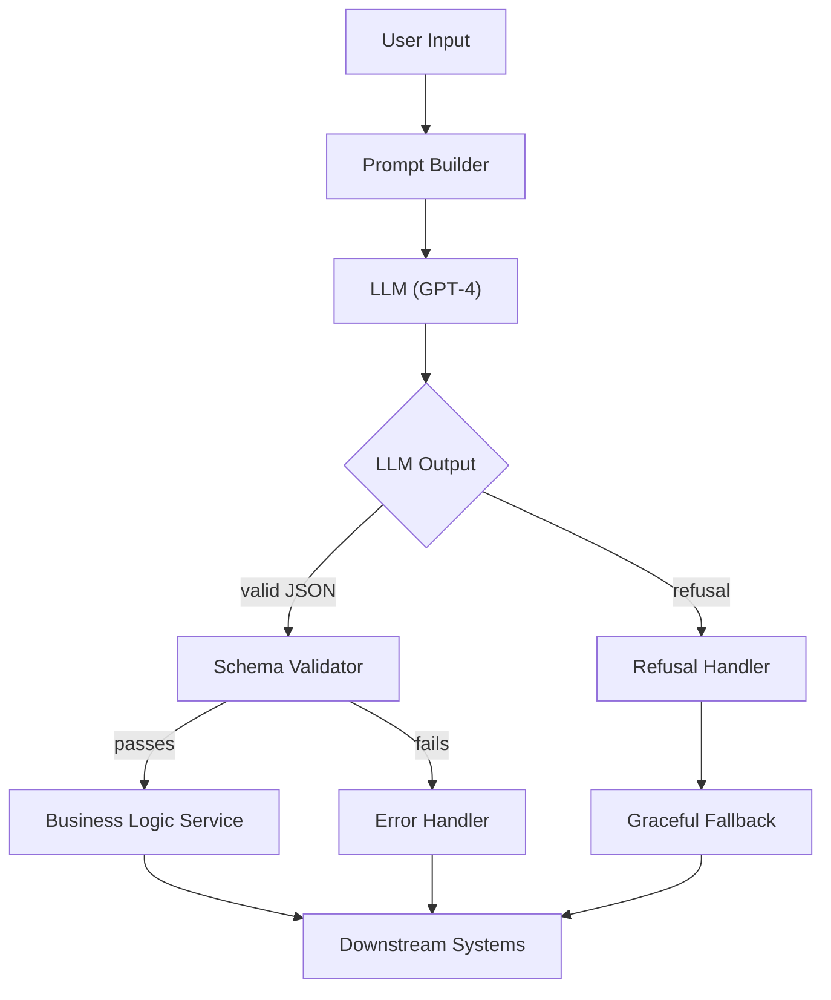
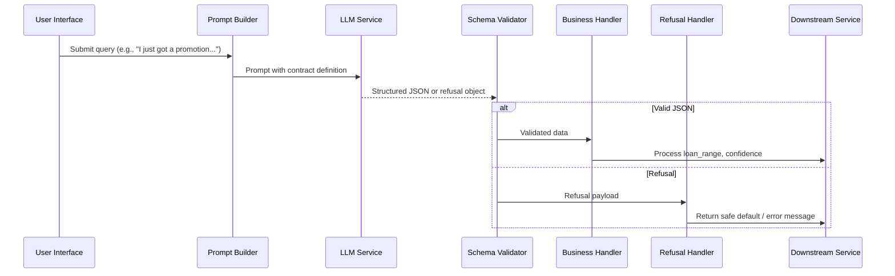

# LLM Output Contract Architecture

## Table of Contents
1. [Overview](#overview)  
2. [Architecture Diagram](#architecture-diagram)  
3. [Data Flow Sequence](#data-flow-sequence)  
4. [JSON Schema Definition](#json-schema-definition)  
5. [TypeScript Interface Generation](#typescript-interface-generation)  
6. [Validator Implementation](#validator-implementation)  
7. [Refusal Handling Strategy](#refusal-handling-strategy)  
8. [Schema Versioning & Migration](#schema-versioning--migration)  
9. [ADR: Structured Output vs Regex](#adr-structured-output-vs-regex)  
10. [Case Study: FinTech Loan Engine](#case-study-fintech-loan-engine)  
11. [Testing Guide](#testing-guide)  
12. [CI/CD Integration](#cicd-integration)  
13. [References](#references)  

---

## Overview
LLM responses are treated as **contracts** rather than free‑form text.  
The contract is expressed as a **JSON Schema** and a generated **TypeScript interface**.  
Incoming LLM output is validated against the schema; on failure the model returns a structured **refusal** payload that downstream services can handle safely.

---

## Architecture Diagram


---

## Data Flow Sequence


---

## JSON Schema Definition

**File:** `schemas/loan-range-v1.json`

```json
{
  "$schema": "http://json-schema.org/draft-07/schema#",
  "title": "LoanRangeV1",
  "type": "object",
  "properties": {
    "loan_range": {
      "type": "object",
      "properties": {
        "min": { "type": "integer", "minimum": 0 },
        "max": { "type": "integer", "minimum": 0 }
      },
      "required": ["min", "max"],
      "additionalProperties": false
    },
    "confidence": {
      "type": "string",
      "enum": ["high", "medium", "low"]
    },
    "refusal": {
      "type": "object",
      "properties": {
        "code": { "type": "string" },
        "message": { "type": "string" }
      },
      "required": ["code", "message"],
      "additionalProperties": false
    }
  },
  "required": ["loan_range", "confidence"],
  "oneOf": [
    { "required": ["loan_range", "confidence"] },
    { "required": ["refusal"] }
  ],
  "additionalProperties": false
}
```

---

## TypeScript Interface Generation

```bash
# Generate interfaces from JSON Schema using quicktype
npx quicktype --src schemas/loan-range-v1.json --src-lang schema --out src/types/LoanRangeV1.ts --just-types
```

**Result (`src/types/LoanRangeV1.ts`):**

```ts
export interface LoanRangeV1 {
  loan_range: {
    min: number;
    max: number;
  };
  confidence: "high" | "medium" | "low";
  refusal?: {
    code: string;
    message: string;
  };
}
```

---

## Validator Implementation

**File:** `src/validation/loanValidator.ts`

```ts
import Ajv, { ValidateFunction } from "ajv";
import schema from "../../schemas/loan-range-v1.json";
import { LoanRangeV1 } from "../types/LoanRangeV1";

const ajv = new Ajv({ allErrors: true, strict: false });
const validate: ValidateFunction<LoanRangeV1> = ajv.compile(schema);

/**
 * Validates raw LLM output.
 * @param payload - Parsed JSON received from LLM.
 * @returns validated payload or throws ValidationError.
 */
export function validateLoanResponse(payload: unknown): LoanRangeV1 {
  if (validate(payload)) {
    return payload as LoanRangeV1;
  }

  const errors = validate.errors?.map((e) => `${e.instancePath} ${e.message}`).join("; ");
  throw new Error(`Loan response validation failed: ${errors}`);
}
```

---

## Refusal Handling Strategy

**File:** `src/handlers/refusalHandler.ts`

```ts
import { LoanRangeV1 } from "../types/LoanRangeV1";

export function isRefusal(response: LoanRangeV1): boolean {
  return !!response.refusal;
}

/**
 * Provides a safe fallback when LLM refuses to comply.
 * @param refusal - Refusal payload from LLM.
 * @returns a default business response.
 */
export function handleRefusal(refusal: { code: string; message: string }) {
  // Log refusal for audit
  console.warn(`LLM refusal (${refusal.code}): ${refusal.message}`);

  // Return a deterministic fallback
  return {
    loan_range: { min: 0, max: 0 },
    confidence: "low" as const,
    fallback: true,
  };
}
```

**Integration Example (`src/services/loanService.ts`):**

```ts
import { validateLoanResponse } from "../validation/loanValidator";
import { isRefusal, handleRefusal } from "../handlers/refusalHandler";

export async function getLoanRecommendation(userPrompt: string) {
  const llmResponse = await callLLM(userPrompt); // Returns raw JSON string
  const parsed = JSON.parse(llmResponse);

  const validated = validateLoanResponse(parsed);

  if (isRefusal(validated)) {
    return handleRefusal(validated.refusal!);
  }

  // Business logic using validated.loan_range & validated.confidence
  return {
    loan_range: validated.loan_range,
    confidence: validated.confidence,
    fallback: false,
  };
}
```

---

## Schema Versioning & Migration

### Version 2 (adds optional `explanation`)

**File:** `schemas/loan-range-v2.json`

```json
{
  "$schema": "http://json-schema.org/draft-07/schema#",
  "title": "LoanRangeV2",
  "type": "object",
  "properties": {
    "loan_range": {
      "type": "object",
      "properties": {
        "min": { "type": "integer", "minimum": 0 },
        "max": { "type": "integer", "minimum": 0 }
      },
      "required": ["min", "max"],
      "additionalProperties": false
    },
    "confidence": {
      "type": "string",
      "enum": ["high", "medium", "low"]
    },
    "explanation": {
      "type": "string",
      "maxLength": 500
    },
    "refusal": {
      "type": "object",
      "properties": {
        "code": { "type": "string" },
        "message": { "type": "string" }
      },
      "required": ["code", "message"],
      "additionalProperties": false
    }
  },
  "required": ["loan_range", "confidence"],
  "oneOf": [
    { "required": ["loan_range", "confidence"] },
    { "required": ["refusal"] }
  ],
  "additionalProperties": false
}
```

### Migration Guidelines
1. **Backward Compatibility:** Clients that ignore unknown fields (`explanation`) will continue to work with V1 responses.
2. **Feature Flag:** Deploy a flag `useLoanSchemaV2` to toggle between V1 and V2 at runtime.
3. **Transform Layer:** If a downstream component only understands V1, strip `explanation` before forwarding.

**Transformation Utility (`src/migration/stripV2.ts`):**

```ts
import { LoanRangeV2 } from "../types/LoanRangeV2";

export function toV1(payload: LoanRangeV2): LoanRangeV1 {
  const { loan_range, confidence, refusal } = payload;
  return { loan_range, confidence, refusal };
}
```

---

## ADR: Structured Output vs Regex

**Title:** Use Structured JSON Output over Regex Parsing for LLM Responses  
**Status:** Accepted  
**Context:** The fintech loan recommendation engine originally extracted monetary ranges using a regex (`/\$(\d+)-(\d+)k/`). Variations in whitespace, hyphens, or missing symbols caused parsing failures and downstream crashes.  
**Decision:** Replace ad‑hoc regex extraction with a contract‑driven JSON schema validated by Ajv.  
**Consequences:**  
- **Positive:**  
  - Validation errors are explicit and centralized.  
  - Refusal handling provides a deterministic fallback.  
  - Schema versioning enables non‑breaking evolution.  
- **Negative:**  
  - Requires prompt engineering to ask LLM for structured data.  
  - Slight increase in latency due to JSON parsing/validation (measured < 30 ms).  

**Related Documents:**  
- `docs/adr/0001-structured-output-vs-regex.md` (this ADR)  
- `schemas/loan-range-v1.json`  

---

## Case Study: FinTech Loan Engine

| Metric                              | Before Structured Output | After Structured Output |
|------------------------------------|--------------------------|--------------------------|
|" Overall error rate (pipeline)     "| 12 %                     | 0.8 %                     |
| Failure mode: malformed range     | Regex miss → crash       | Validation error → refusal |
| Illegal‑activity requests          | Ignored / returned text  | Refusal returned (code `ILLEGAL_REQUEST`) |
|" Time to onboard new field (`explanation`) "| 2 weeks (code changes) | 1 day (schema version bump) |

**Key Takeaway:** Enforcing a contract reduced runtime exceptions by > 99 % and provided a clean safety net for disallowed queries.

---

## Testing Guide

### Unit Tests (Jest)

**File:** `tests/loanValidator.test.ts`

```ts
import { validateLoanResponse } from "../src/validation/loanValidator";

describe("LoanRangeV1 validation", () => {
  it("accepts a valid payload", () => {
    const payload = {
      loan_range: { min: 5000, max: 10000 },
      confidence: "high"
    };
    expect(validateLoanResponse(payload)).toMatchObject(payload);
  });

  it("rejects missing fields", () => {
    const payload = { confidence: "low" };
    expect(() => validateLoanResponse(payload)).toThrow(/validation failed/);
  });

  it("detects refusal payload", () => {
    const payload = {
      refusal: { code: "UNSUPPORTED", message: "I cannot comply." }
    };
    const result = validateLoanResponse(payload);
    expect(result.refusal?.code).toBe("UNSUPPORTED");
  });
});
```

### Integration Test (Mock LLM)

```ts
import { getLoanRecommendation } from "../src/services/loanService";
import * as llm from "../src/llmClient";

jest.mock("../src/llmClient");

test("handles LLM refusal gracefully", async () => {
  (llm.callLLM as jest.Mock).mockResolvedValue(
    JSON.stringify({ refusal: { code: "ILLEGAL", message: "Advice not permitted." } })
  );

  const result = await getLoanRecommendation("Help me launder money");
  expect(result.fallback).toBe(true);
  expect(result.loan_range.min).toBe(0);
});
```

Run tests:

```bash
npm test
```

---

## CI/CD Integration

**GitHub Actions Workflow (`.github/workflows/ci.yml`)**

```yaml
name: CI

on:
  push:
    branches: [ main ]
  pull_request:
    branches: [ main ]

jobs:
  build-test:
    runs-on: ubuntu-latest
    steps:
      - uses: actions/checkout@v4
      - name: Setup Node
        uses: actions/setup-node@v4
        with:
          node-version: 20
      - run: npm ci
      - run: npm run lint
      - run: npm test -- --ci --coverage
      - name: Publish Schema Artifacts
        if: github.ref == 'refs/heads/main'
        run: |
          # Example: store JSON schemas as GitHub Release assets
          gh release upload v$(date +%Y%m%d%H%M) schemas/*.json
```

---

## References
- JSON Schema Draft‑07: https://json-schema.org/specification-links.html#draft-7  
- Ajv Validation Library: https://github.com/ajv-validator/ajv  
- quicktype Type Generation: https://github.com/quicktype/quicktype  
- OpenAI function calling (structured output) documentation.  

--- 

*End of documentation.*
